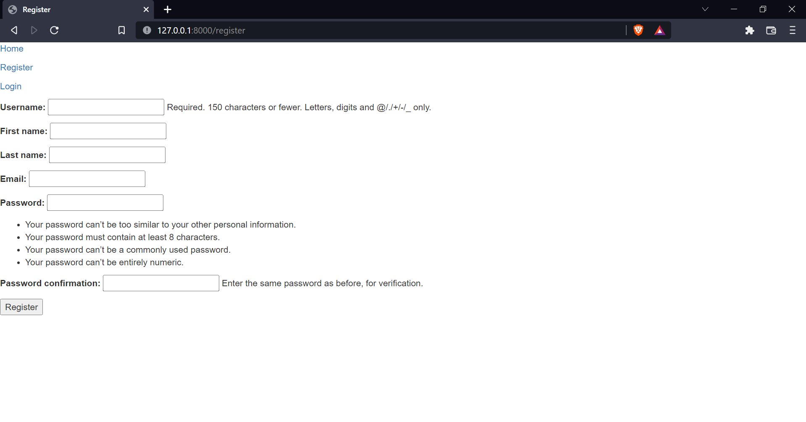
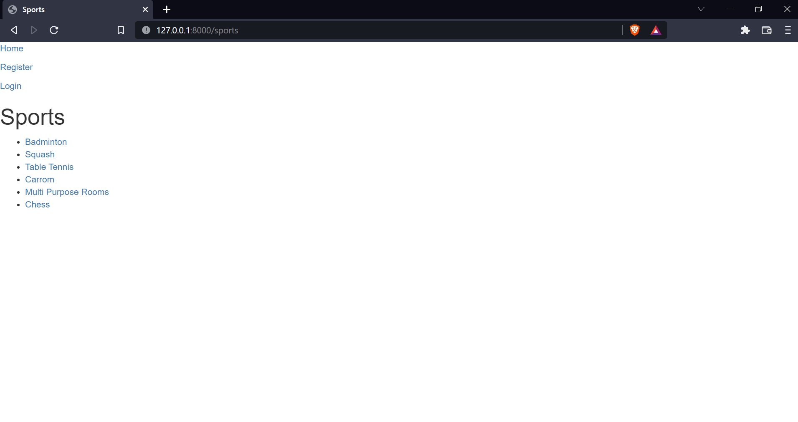
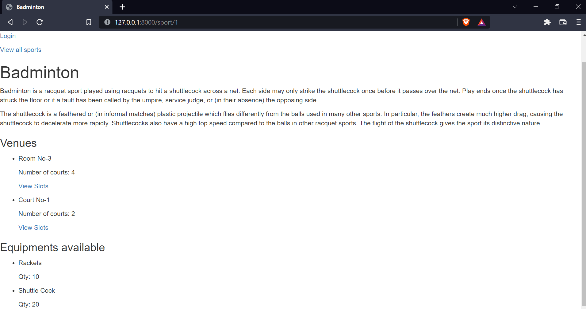
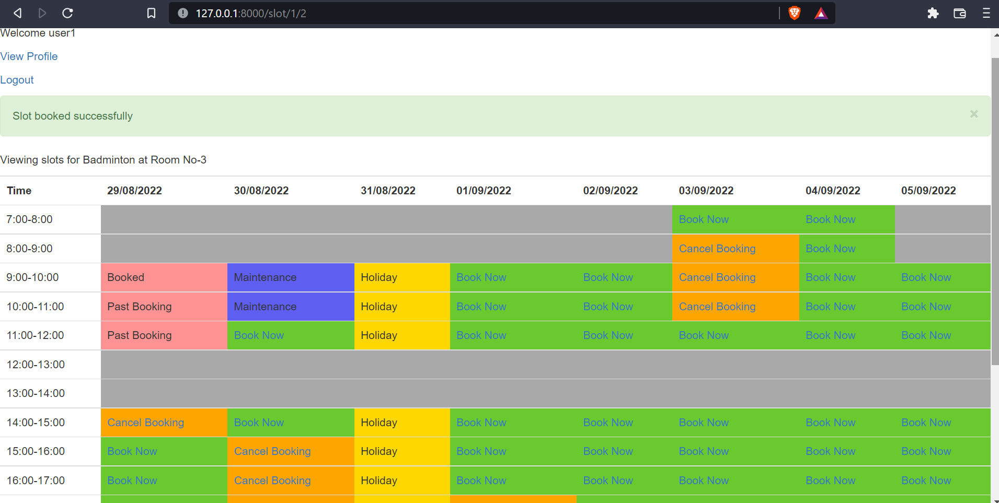
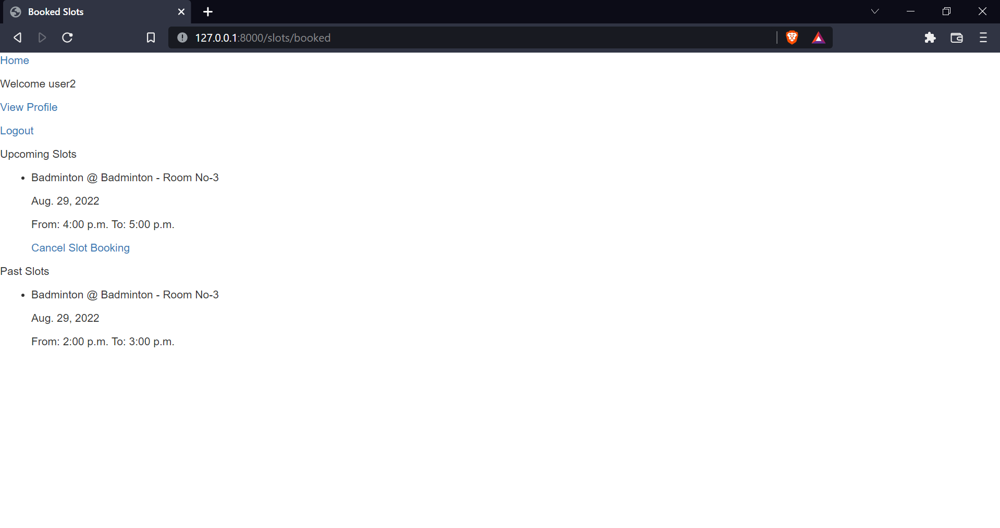
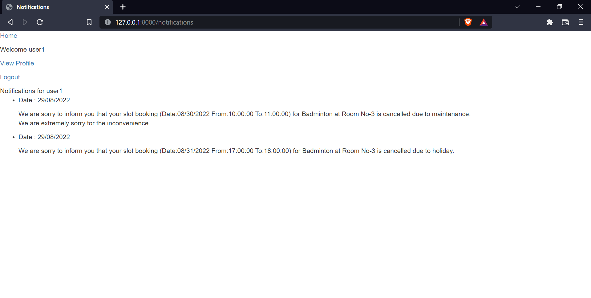
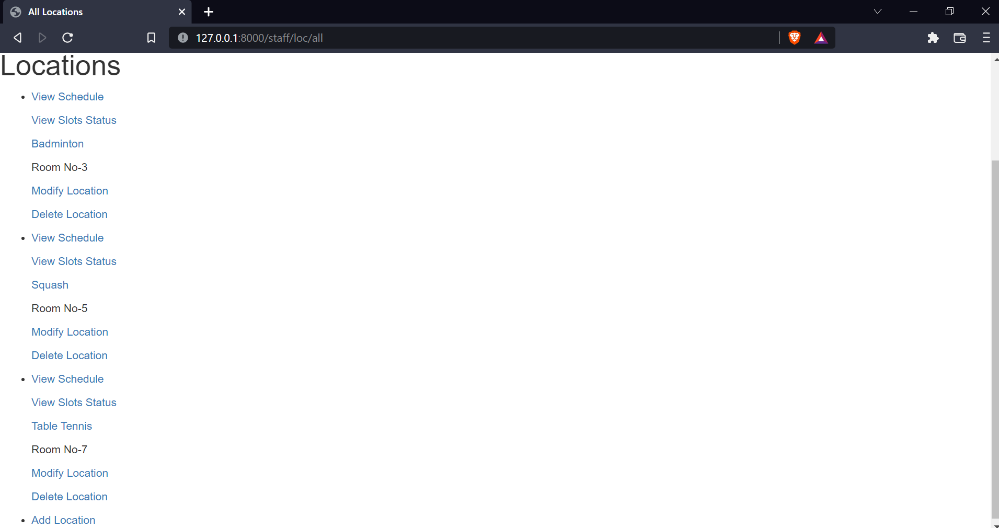
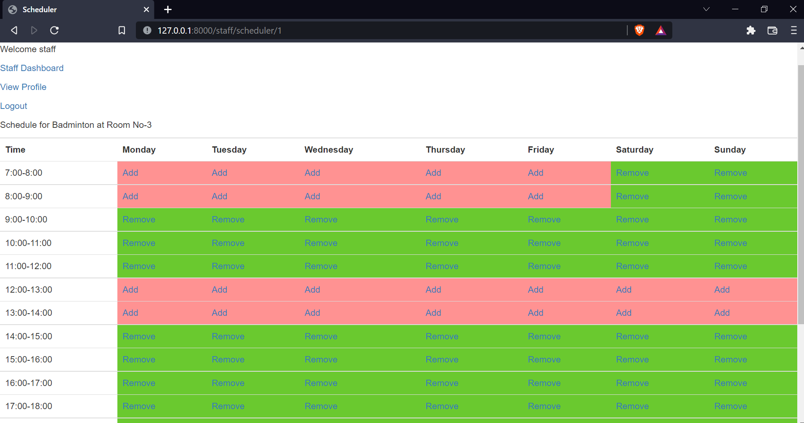
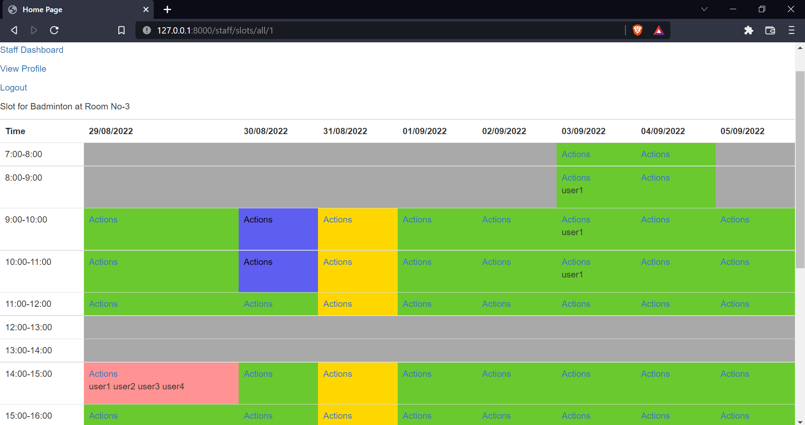
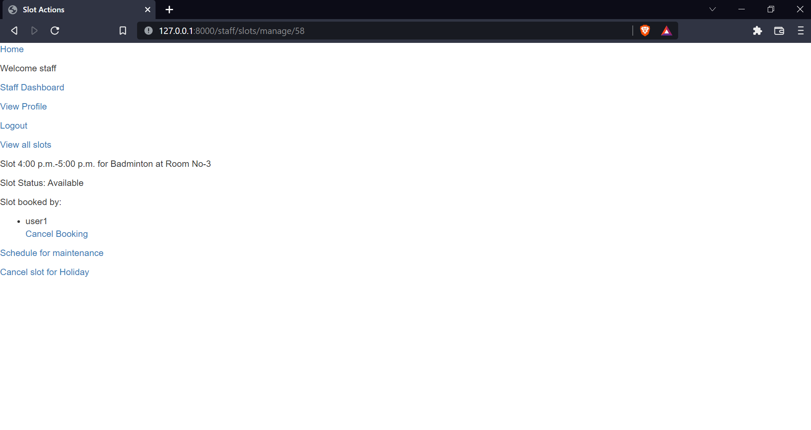

# Slot Booking

### Site deployed on [heroku](https://slotbooking-vedant.herokuapp.com/)

---

## Features

- Registration system for user
- Separate page for each sport which displays information about the sport, the venues[^1]/courts available, inventory for the sport and the slot status
[^1]: Venue may contain multiple courts/arenas
- Staff can add inventory, sport, courts/venue
---
- **Schedules and Slot**
- Staff can create a schedule for each venue
- Slots will be generated automatically from the given schedule 
---
- **Slots are of 4 types**:
  - Available
  - Booked
  - On maintenance
  - Holiday (Slot cancelled due to holiday)
---
- **Details of slot booking**
  - Users can book a slot or cancel a booked slot
  - User can book atmost 3 slots per day
  - Slot booking is accepted automatically
  - Staff can view all slot booking and cancel booking for any user if needed
  - Staff can schedule maintenance for a slot, cancel scheduled maintenance, or cancel slot due to holiday
---
- **Profile**
  - All user have a profile page
  - Users can view their past and upcoming booked slot
  - System generated notifications are sent when
    - User's booked slot is cancelled by staff for some reason
    - The booked slot is cancelled due to maintenance or holiday
---

## Database Model
### Sports app
- **Sport** model stores name and info
- **Venue** model stores name(location,room no,hall no,etc.) and number of courts
- **Inventory** model stores equipment name and its quantity
---
### Slots app
- **Location** model stores a combination of **Sport** and **Venue** for easy access in **Slot** and **Schedule**
- **Schedule** stores the start and end time of a slot for a given day at a given **Location**
- **Slot** stores the date, status and users who have booked this slot
--- 
### Users app
- **Notification** model for storing the time and text of system generated notification
---

## Special Features
- **Grid structure** for schedule modification and slot booking
- **Custom django command** for updating slots for the next week depending on schedule which can be scheduled to run everyday at a specific time (the slots will be available to book from this time)

---

## Access Controls
- Users can view any sport page without login
- Only registered users can view and book slots
- Admin can assign and remove role of **Staff** for any user
- Staff and admin can modify information of sport page, venue, inventory, schedule and manage a slot

---

## Screenshots
### Registration page

### All Sports

### Individual Sport page

---

### Slot booking and cancelling (User)

### Booked Slots (User)

### Notification (User)

---

### Staff Dashboard

### All locations (Staff)

---

### Scheduler (Staff)

### Slot status view (Staff)

### Slot manager (Staff)

